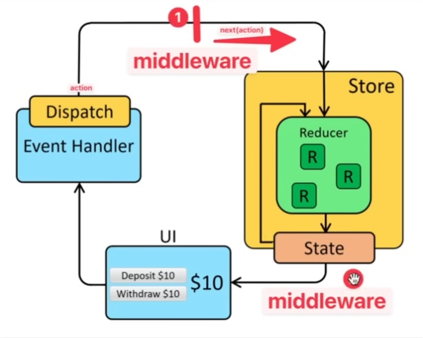

# REDUX TOOLKIT

Esta es la forma predeterminada de utilizar REDUX y su control de los estados.

## Librerias a utilizar en este proyecto

En vez de utilizar el clásico LINTER, en esta ocasion utilizaremos BIOME, quienes continuan con el legado de ROME (ya sin soporte).

Instalamos el BIOME:
```
npm install --save-dev --save-exact @biomejs/biome
```

Luego ejecutamos el siguiente comando:

```
npx @biomejs/biome init
```
Al ejecutar este ultimo comando, nos crea un nuevo archivo en nuestro proyecto, que se llama "biome.json".

```
{
	"$schema": "https://biomejs.dev/schemas/1.4.0/schema.json",
	"organizeImports": {
		"enabled": true
	},
	"linter": {
		"enabled": true,
		"rules": {
			"recommended": true
		}
	},
	"formatter": {
		"enabled": true
	}
}
```
En ese archivo agregamos el "formatter" y lo pusimos en TRUE.

Podemos configurar muchos mas aspectos que deseamos automatizar en nuestro codigo.

## Configuraciones del Area de trabajo

Para evitar conflictos entre las configuraciones que dispongamos en el editor de codigos, podemos crear una carpeta ".vscode", que contenga el archivo "settings.json". Esta configuracion solo funcionará en este proyecto.

**settings.json**

```
{
    "editor.formatOnSave": true,
    "editor.codeActionsOnSave": {
        "source.fixAll.biome": true,
        "source.organizeImports": true 
    },
    "[javascript]": {
        "editor.defaultFormatter": "biomejs.biome"
    },
    "[javascriptreact]": {
        "editor.defaultFormatter": "biomejs.biome"
    },
    "[typescript]": {
        "editor.defaultFormatter": "biomejs.biome"
    },
    "[typescriptreact]": {
        "editor.defaultFormatter": "biomejs.biome"
    }
}
```

En el "formatOnSave", lo que hará es formatear el codigo cuando guardemos los cambios. Y todo los errores del codigo se arreglen con el BIOME.

Por ultimo, especificamos en cuales lenguajes de programacion vamos a utilizar BIOME.

## TREMOR

https://www.tremor.so/

Es un pack de componentes para dar mejores estilos a los CHARTS, FORMS, DASHBOARDS, etc.

Lo instalamos:
```
npm install @tremor/react
```

## TailwindCSS

Junto con TREMO vamos a requerir de TAILWINDCSS: 

```
npm i tailwindcss postcss autoprefixer -D
```
Lo instalamos como una dependencia de desarrollo. Junto con esto creamos los archivos de configuracion.

```
npx tailwindcss init -p
```

Esto nos creamos los archivos *tailwind.config.js* y el *postcss.config.js*.


## Redux

Se utilizará la forma mas recomendada de utilizar REDUX, que es **REDUX TOOLKIT** 

En el archivo "main.tsx", ponemos el PROVIDER de REDUX junto con la STORE: 

```
import { store } from './store/index.ts'
import { Provider } from 'react-redux'

ReactDOM.createRoot(document.getElementById('root')!).render(
  <Provider store={store}>
    <App />
  </Provider>,
```

Envolvemos nuestra aplicación con REDUX. Para poder tener un orden con nuestros datos vamos a crear un SLICE con c/u de ellos.

## Screaming Architecture

A la hora de ordenar los archivos y carpetas, lo mejor sería ver las referencias de la *screaming architecture* en donde ponemos el negocio por delante de todo, y no al revés.
https://blog.cleancoder.com/uncle-bob/2011/09/30/Screaming-Architecture.html

## Middleware

Es cierta ejecucion ejecutandose en mitad de otra. Es casi similar al PROXY.
Siempre vamos a ejecutar una funcion entre medio para ir al siguiente paso, ya sea una ACTION, a la STORE, etc.
Cada metodo q se ejecuta aqui, lo hace en momento distinto, es por eso que necesita las 3 funciones de forma separada.

```
const exampleeMiddleware = (store) => (next) => (action) => {
	// Do something before
    next(action)
    // Do something after
}
```

Una vez hecho esto, se lo tenemos que pasar a la STORE, en donde puede ser uno, o mas, MIDDLEWARE que le podemos pasar.

Tenemos la posibiliad de ejecutar algo antes o despues de una ACTION.




## Sonner

Podemos utilizar esta libreria para gestionar las notificaciones, lo instalamos con el siguiente comando: 

```
npm install sonner
```

## Rollback STATE

Esto nos permite recuperar un estado anterior y volver a colocarlo en caso de que algo haya salido mal.
En la UI podemos ver reflejado el cambio que ocurrio con el evento, pero si hay un error de cualquier tipo, ya sea en la base de datos por ejemplo, el estado retrocede y vuelve a como esataba antes. En ese caso podemos mostrar un error, o simplemente como vuelve ese cambio a como estaba.